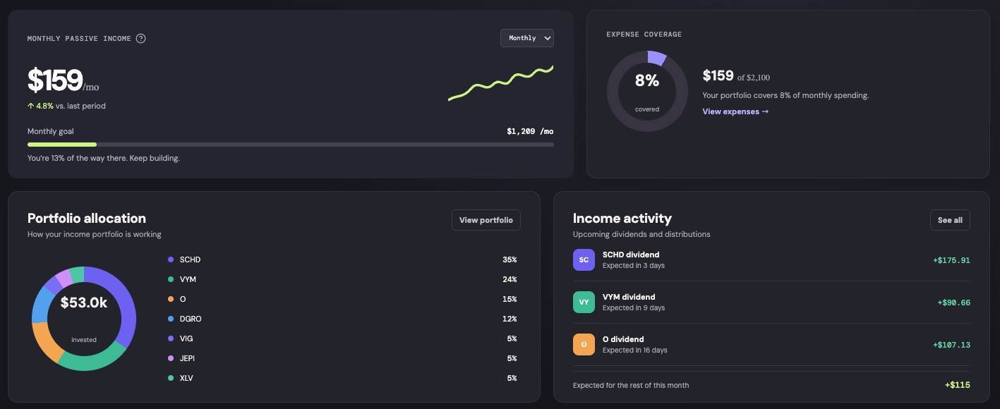
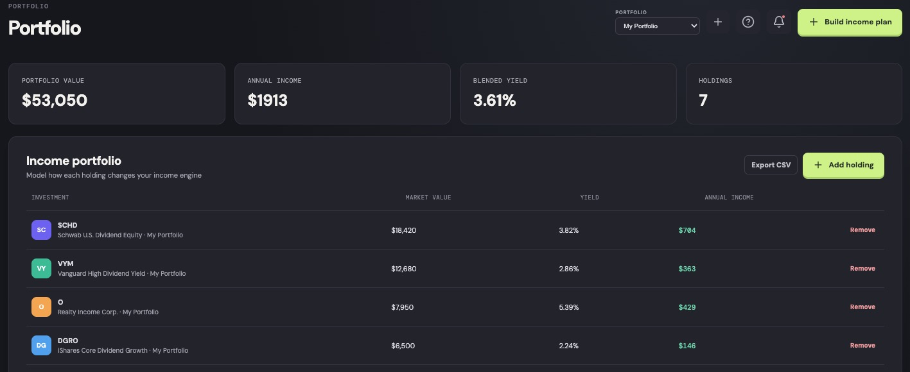
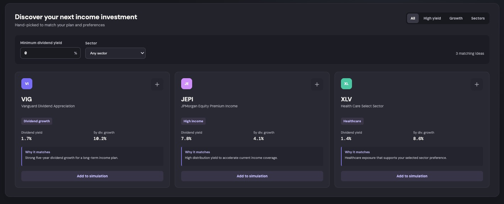

# Divrion

> A calmer way to build your income-investing future.

Divrion is a responsive, dark-mode-first dashboard for planning dividend income, modelling a portfolio, discovering income investments, and seeing how much of your monthly life is already covered.

> Source-available for noncommercial use under the [PolyForm Noncommercial License 1.0.0](LICENSE).

## Product preview

### Income overview



Track passive income, expense coverage, allocation, activity, and your next goal in one focused view.

### Portfolio modelling



Model holdings, distinguish simulated positions, and review the income impact of allocation changes.

### What-if simulation



Try an investment amount before acting and see how it changes expected income.

## What you can do

| Workspace | Purpose |
| --- | --- |
| **Overview** | See passive-income progress, expense coverage, allocation, activity, and timely ideas in one place. |
| **Income plan** | Set daily, monthly, or yearly income goals; tune your monthly contribution and risk profile; follow an interactive four-year forecast. |
| **Portfolio** | Inspect value, blended yield, and income at a holding level. Add or remove simulated holdings to see the impact. |
| **Discover** | Filter ideas by high yield, dividend growth, or sector, and add them to your simulation. |

### Import portfolio data

From the Portfolio workspace, choose **Import** to upload a CSV or JSON export from a broker, spreadsheet, or another tracker. Divrion recognizes common field names such as `Symbol`/`Ticker`, `Name`, `Market Value`, `Shares`/`Quantity`, `Yield`, `Annual Income`, `Portfolio`, and `Account`, then creates one or more imported portfolios automatically.

## Bring-your-own market data

Divrion is designed around a transparent, free-first data model:

- **Local calculations:** imports, goals, and simulations stay in the browser.
- **Official-source foundation:** a future backend can enrich US dividend events from issuer announcements and SEC EDGAR filings, keeping the source and refresh timestamp visible.
- **Optional personal provider:** users can connect their own Alpha Vantage API key from **Data sources**. The key stays only in that browser and can refresh positions with a current price, dividend yield, calculated market value, and estimated annual income.

Imports need `Shares` or `Quantity` for price-based valuation. Market-data refreshes are explicitly timestamped; future ex-dividend and payment dates should always be confirmed against the issuer announcement.

## Shareable views

Every workspace has its own URL: `/`, `/income-plan`, `/portfolio`, `/discover`, and `/data-sources`. Browser back/forward navigation works between them. When a holding has no imported or provider-supplied dividend yield, Divrion marks it explicitly and links to the market-data connection instead of inventing a value.

## Quick start

**Prerequisites:** Node.js 20+ and npm.

```bash
git clone git@github.com:bregman-arie/divrion.git
cd divrion
npm install
npm run dev
```

Vite will print the local address (normally `http://localhost:5173`). Open it in your browser.

## Demo mode

Divrion starts with an empty portfolio by default. To load the illustrative portfolios and sample income data, open the app with the `demo` query flag:

```text
http://localhost:5173/?demo
```

You can also enable this behavior at build time with `VITE_DEMO=true`.

## Other commands

```bash
# Build an optimized production bundle
npm run build

# Preview the production bundle locally
npm run preview
```

## Design notes

The interface uses a high-contrast graphite palette with violet income data and lime actions. It is designed to work from desktop down to a compact mobile navigation layout, while keeping the most useful portfolio figures visible.

## Current state

This is an interactive product prototype using illustrative market and portfolio data only. It does not provide financial advice, execute trades, or use live market prices.

## Stack

- React
- Vite
- Lucide icons
- Plain CSS with responsive breakpoints
